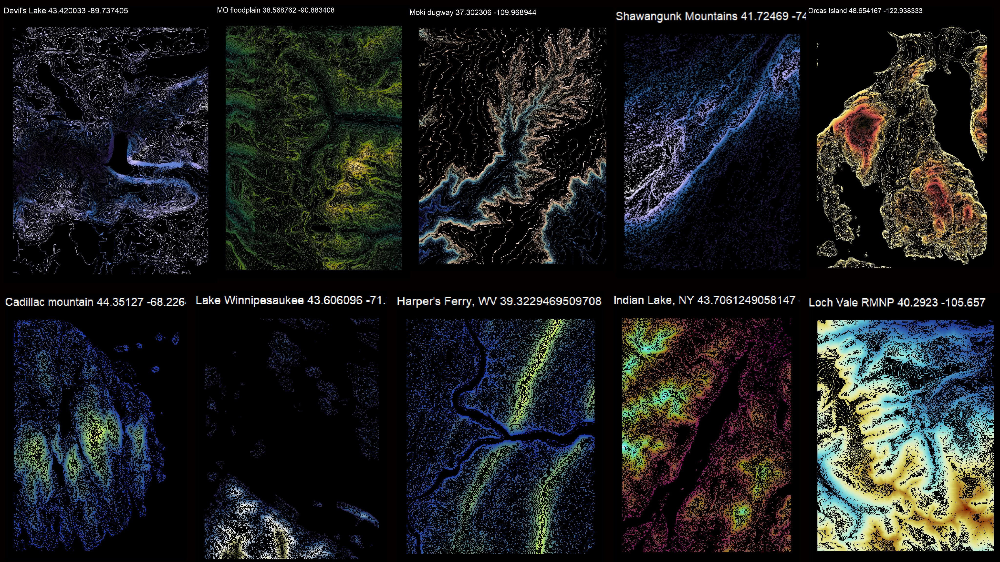
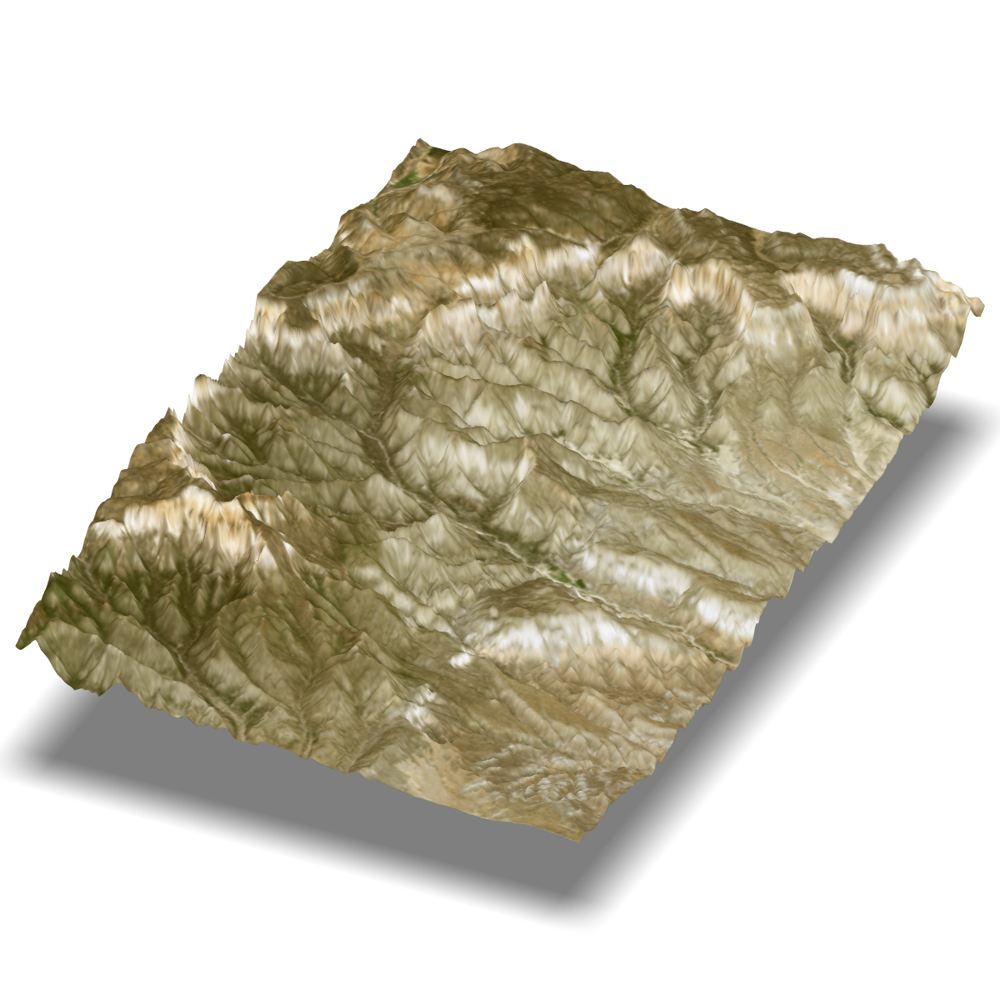
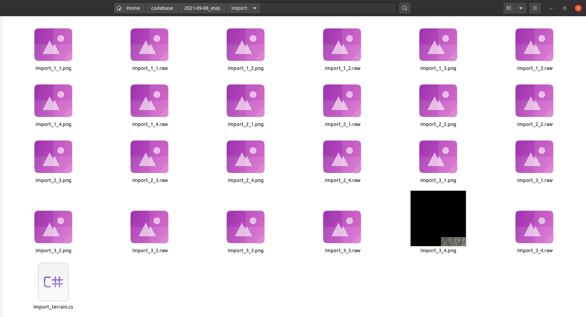
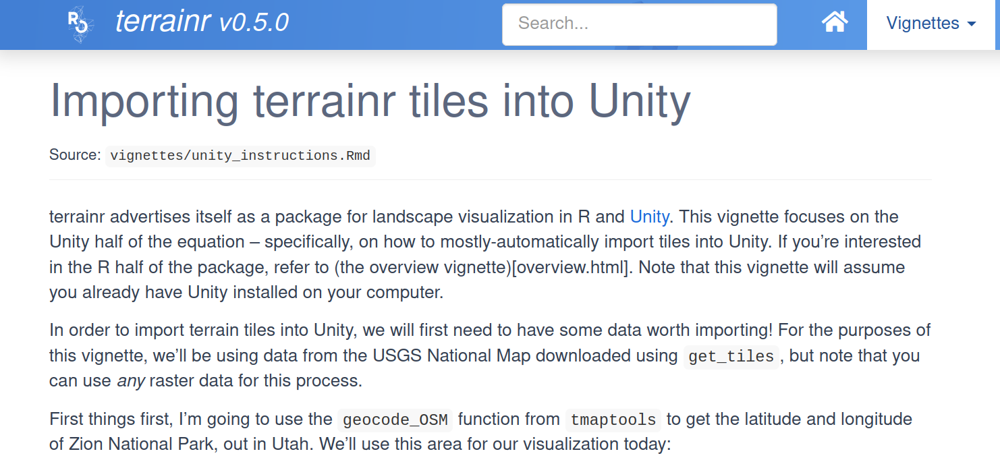
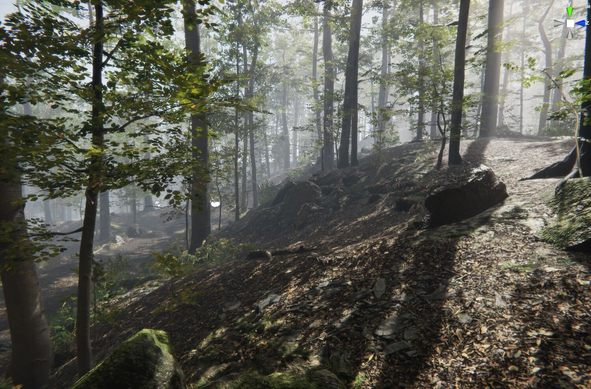

```{r setup, include=FALSE}
options(htmltools.dir.version = FALSE)
knitr::opts_chunk$set(
  fig.width=9, fig.height=3.5, fig.retina=3,
  out.width = "100%",
  cache = FALSE,
  echo = TRUE,
  message = FALSE, 
  warning = FALSE,
  fig.show = TRUE,
  hiline = TRUE
)
library(ggplot2)
library(terrainr)
library(sf)
theme_set(theme(axis.text = element_blank()))
xaringanExtra::use_webcam()
```

```{r xaringan-themer, include=FALSE, warning=FALSE}
library(xaringanthemer)

style_duo_accent(
  primary_color = "#26375b",
  secondary_color = "#27686d",
  inverse_header_color = "#FFFFFF"
)
```

background-image: url("ca.jpg")
background-size: contain

---

# About Me

.pull-left[

- Mike Mahoney

- Ph.D. Student at SUNY-ESF

- Focusing on environmental visualization as a way to think about large-scale systems

- Background in machine learning, remote sensing, and forest ecology

- https://mm218.dev

]

.pull-right[

```{r, echo=FALSE}
knitr::include_graphics("https://github.com/mikemahoney218.png")
```

]

---

# Outline

### 1. What's terrainr?

### 2. Why visualize in game engines?

### 3. What's next?

<br />

<br />

Slides available at https://mm218.dev/esip2021

---
class: inverse center middle

# What's terrainr?

???
So, first things first, what is terrainr?

---

# What's terrainr?

.pull-left[

- New R package with two focuses:

  1. Data access and retrieval
  
  2. Spatial data visualization

<br />  

- https://github.com/ropensci/terrainr

]

.pull-right[

```{r, echo=FALSE}
knitr::include_graphics("https://github.com/ropensci/terrainr/raw/main/man/figures/logo.png")
```

]

---
class: title
background-image: url("clark_USGSNAIPPlus_1_1.png")


# Data access and retrieval

---


```{r}
library(sf)

campsites <- "https://opendata.arcgis.com/datasets/06993a2f20bf42d382c8ce6bd54027c4_0.geojson"
campsites <- read_sf(campsites)
```

--

```{r fig.width=8}
library(ggplot2)

ggplot(campsites) + 
  geom_sf()
```

---

```{r}
library(terrainr)
downloaded_data <- get_tiles(campsites,
                             output_prefix = "bryce_canyon",
                             services = c("elevation", "ortho"),
                             resolution = 30)
```

--

```{r}
downloaded_data
```


---
class: inverse title
background-image: url("contour.png")

# Spatial data visualization

---

.pull-left[

```{r fig.width=4}
library(raster)

downloaded_data$elevation |> 
  raster() |> 
  plot()
```

]

.pull-right[

```{r fig.width=4}
library(raster)

downloaded_data$ortho |> 
  stack() |> 
  plotRGB(scale = 1)
```

]

---

```{r, fig.width=10}
library(ggplot2)

downloaded_data$elevation |> 
  raster() |> 
  as.data.frame(xy = TRUE) |> 
  setNames(c("x", "y", "z")) |> 
  ggplot(aes(x, y, fill = z)) + 
    geom_raster() + 
    scale_fill_gradientn(
      colors = (rev(terrain.colors(255)))
      ) + 
    coord_sf(crs = 4326)
```


---

```{r, fig.width=6}
ggplot() + 
  geom_spatial_rgb(data = downloaded_data$ortho,
                   aes(x, y, r = red, b = blue, g = green)) +
  coord_sf(crs = 4326)
```

---

```{r, fig.width=6}
ggplot() + 
  geom_spatial_rgb(data = downloaded_data$ortho,
                   aes(x, y, r = red, b = blue, g = green)) +
  coord_sf(crs = 4326) + 
  geom_sf(data = campsites, color = "red")
```


---

```{r}
ggplot() + 
  geom_spatial_rgb(data = "img.png",
                   aes(x, y, r = red, b = blue, g = green)) + 
  coord_fixed() + 
  labs(caption = "Artwork by @allison_horst")
```

---
class: center middle




---

.pull-left[

```{r eval=FALSE}
library(rayshader)
library(tiff)
library(raster)

downloaded_data$ortho <- 
  readTIFF(downloaded_data$ortho)
downloaded_data$elevation <- 
  raster_to_matrix(
    raster(downloaded_data$elevation)
    )

rayshader::plot_3d(
  downloaded_data$ortho,
  downloaded_data$elevation,
  zscale = 10,
  windowsize = 1200,
  zoom = 0.75,
  theta = 25,
  phi = 35,
  solid = FALSE
)
```

]

.pull-right[

```{r, echo = FALSE}

```

]

---

```{r, eval = FALSE}
downloaded_data <- get_tiles(campsites,
                             services = c("elevation", "ortho"))
```

---

```{r, eval = FALSE}
downloaded_data <- get_tiles(campsites,
                             services = c("elevation", "ortho"))

mapply(
  merge_rasters,
  downloaded_data,
  c("elevation.tif", "orthoimagery.tif")
)
```

---

```{r, eval = FALSE}
downloaded_data <- get_tiles(campsites,
                             services = c("elevation", "ortho"))

mapply(
  merge_rasters,
  downloaded_data,
  c("elevation.tif", "orthoimagery.tif")
)

make_manifest("elevation.tif", "orthoimagery.tif")
```

---

```{r echo = FALSE}

```

---

```{r echo=FALSE, out.width='100%'}

```

https://docs.ropensci.org/terrainr/articles/unity_instructions.html

---

```{r echo=FALSE, out.width='100%'}

```

---

# Thank you!

This work was financially supported by the State University of New York via the ESF Pathways to Net Zero Carbon initiative.

#### More terrainr:

`r icons::fontawesome("github")` [ropensci/terrainr](https://github.com/ropensci/terrainr)

`r icons::fontawesome("book")` [https://docs.ropensci.org/terrainr/](https://docs.ropensci.org/terrainr/)

#### Find me online:

`r icons::fontawesome("github")` [@mikemahoney218](https://github.com/mikemahoney218/)

`r icons::fontawesome("twitter")` [@mikemahoney218](https://twitter.com/mikemahoney218/)

`r icons::fontawesome("globe")` [mm218.dev](https://mm218.dev)

<br />

Slides available at https://mm218.dev/esip2021

